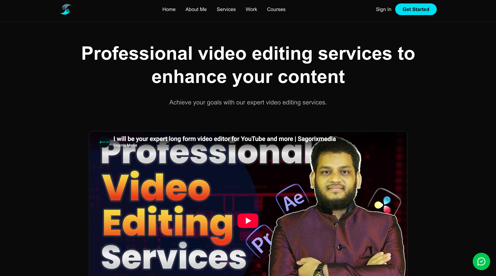
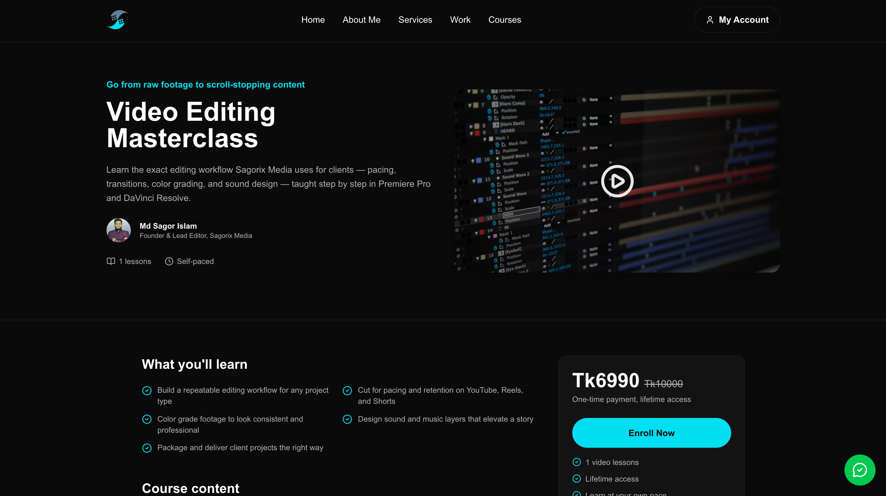
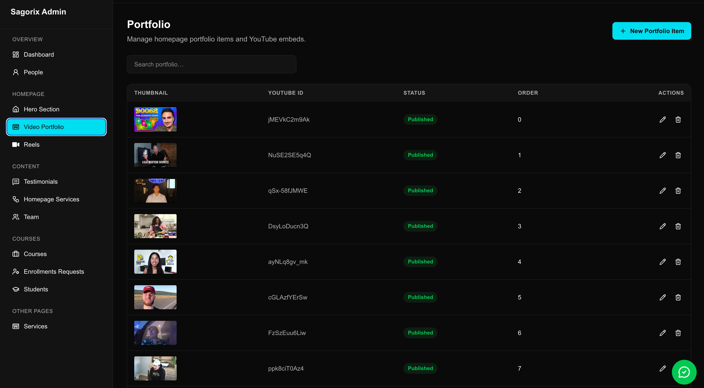

# Sagorix Media

🎥 Full-stack media agency portfolio, course platform & admin CMS

👨‍💻 **Role:** Full-Stack Developer

🚧 **Status:** Active project — feature-complete core, hardening in progress

---

## Overview

Sagorix Media is a full-stack Next.js application built for a creative media business. It combines three things in one codebase:

- A **public marketing site** — portfolio, services, reels, team, testimonials, and a contact form
- A **lightweight course platform (LMS)** — course catalog, curriculum, protected video lessons, and a manual enrollment/approval workflow
- An **admin CMS** — role-protected dashboard for managing every piece of content and user data above

It solves two related business problems: presenting a media professional/agency online with fully editable content, and selling or distributing educational courses with manual payment-reference verification and gated lesson access.

---

## What I Built

### Public / Client-Facing

- Homepage, services, portfolio, and reels (video-first content)
- Team and testimonials sections
- Business stats, working-style/process, and FAQ content
- Contact form with email delivery
- WhatsApp contact action
- Course catalog and course detail pages (curriculum, pricing, instructor info)
- Registration and sign-in (email/password + Firebase-supported providers)
- Course enrollment request flow — submit payment method (bKash/Rocket/Nagad) and transaction ID for manual verification
- Pending/approved enrollment states
- Protected lesson player (YouTube-based) with in-session progress tracking

### Admin Dashboard

- Dashboard statistics
- User listing and role management
- Full course CRUD with nested modules/lessons, draft/published states
- Enrollment listing, filtering, approval, rejection, editing, and manual enrollment
- CRUD for services, team members, portfolio items, reels, and testimonials
- Homepage section management (hero, services, portfolio, reels, testimonials)
- Cloudinary-based media upload and selection

---

## Tech Stack

| Category | Technologies |
|---|---|
| Frontend | Next.js 16 (App Router), React 19, TypeScript |
| Backend | Next.js server runtime (API routes + server actions) |
| Database | MongoDB, Mongoose 8 |
| Authentication | Firebase Authentication (client) + Firebase Admin SDK (server) |
| Validation | Zod |
| Styling / Animation | Tailwind CSS 4, Framer Motion |
| Media | Cloudinary (uploads), YouTube (video content) |
| Email | Nodemailer + Gmail |
| Notifications | Sonner (toasts) |

---

## Architecture

```
app/        → routes, layouts, server components, API route handlers
actions/    → server actions for mutations
services/   → database access & business logic (server-only)
models/     → Mongoose schemas
lib/        → auth, database, validation, third-party integrations
components/ → reusable public + admin UI
content/    → static content (FAQ, pricing, etc.)
```

**Typical request flow:**

```
Browser → Next.js page / API route → Auth check → Zod validation
        → Service function / server action → Mongoose model → MongoDB
        → Normalized response or redirect
```

### Authentication flow

1. User authenticates via Firebase client SDK.
2. Client sends the Firebase ID token to a Next.js API route.
3. Firebase Admin SDK exchanges it for a 5-day, HTTP-only session cookie (secure in production, `SameSite=Lax`).
4. Server code reads and verifies the session cookie (with revocation checking) on each request.
5. The verified Firebase UID is used to look up the MongoDB user record, which supplies the application role.

### Authorization

Role-based, backed by a `role` field on the MongoDB `User` model (`user`, `admin`, `editor`). Admin access is enforced server-side in the admin layout, server actions, and service calls — not just hidden in the UI. Middleware only checks that a session cookie *exists*; the actual verification and role check happen in server code.

---

## Database Models

| Model | Purpose |
|---|---|
| `User` | Firebase-linked application user with role |
| `Course` | Course metadata, pricing, nested modules & lessons |
| `Enrollment` | Enrollment request with payment method, transaction ID, and status (`pending`/`approved`/`rejected`) |
| `Service`, `HomepageService` | Service offerings (site-wide and homepage-specific) |
| `PortfolioItem`, `Reel` | Video-based portfolio/reel content (YouTube-linked) |
| `TeamMember`, `Testimonial` | Team and social-proof content |
| `WorkProject` | Case-study style project entries (admin-managed) |
| `HomepageSection` | Flexible homepage content blocks (currently: hero) |
| `Faq` | Defined in schema but not yet wired to an active service — FAQ content is currently static |

---

## Engineering Notes — Known Limitations

This is presented honestly as an active project, not a fully hardened production platform. Known gaps identified in an internal audit:

- **No automated tests** — no Jest/Vitest/Playwright/Cypress suite yet
- **Contact form** accepts unescaped input into HTML email content — no schema validation or rate limiting yet
- **Registration** trusts some client-supplied identity fields (email, name, phone) alongside the verified Firebase UID
- **Open redirect risk** in the sign-in flow's `redirect` query parameter
- **Draft course exposure** — public course lookups don't consistently filter to `status: "published"`
- **Duplicate enrollment risk** — no compound unique index on `(userId, courseSlug)`; check-then-create isn't atomic
- **Legacy `/api/enrollments` endpoint** overlaps with the newer `/api/enroll` flow and should be consolidated
- **Course progress** is tracked in client-side React state only — not persisted to the database
- **Public work page** currently uses static content rather than the admin-managed `WorkProject` model
- **`editor` role** exists in the schema but has no implemented permission model yet
- No payment gateway integration — payment methods and transaction IDs are recorded for manual verification only, not processed

## Screenshots

### Homepage


### Course Details


### Admin Dashboard


---

## 🔒 Client Confidentiality

This is a client-owned production application.

The source code is private and is not included in this repository.

This repository is a public case study containing only information and visual materials that can be publicly shared.

---

## 🌐 Live Project

**Sagorix-Media**
https://www.sagorixmedia.com/

---

## 👨‍💻 Developer

**Fuad Hasan**
Full-Stack Developer
Next.js • React • TypeScript • Node.js • MongoDB

🌐 Portfolio: [fuadhasan.dev](https://www.fuadhasan.dev/)
💼 LinkedIn: [linkedin.com/in/fuadhasandev](https://linkedin.com/in/fuadhasandev)